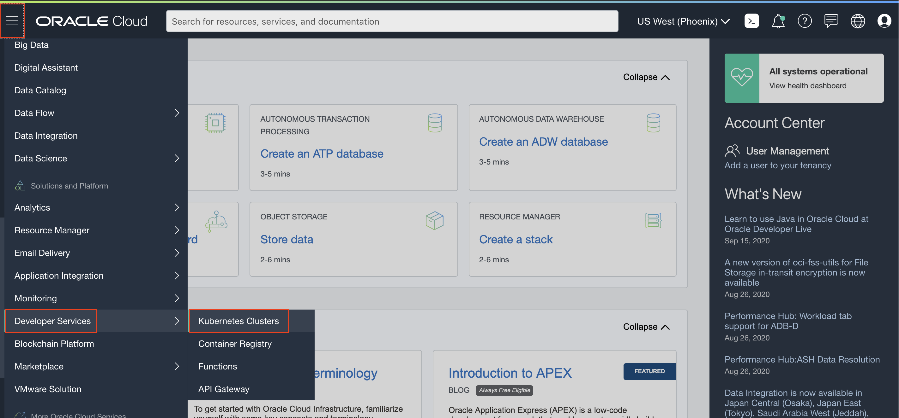
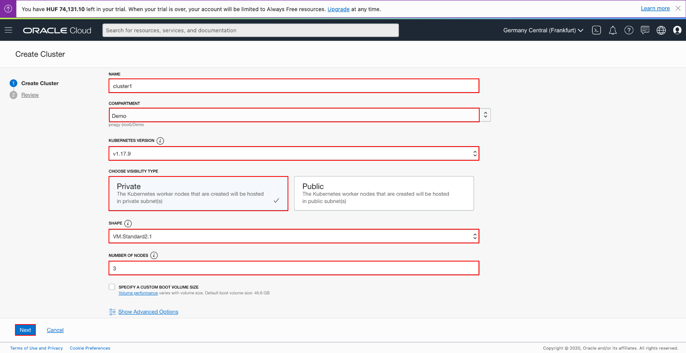
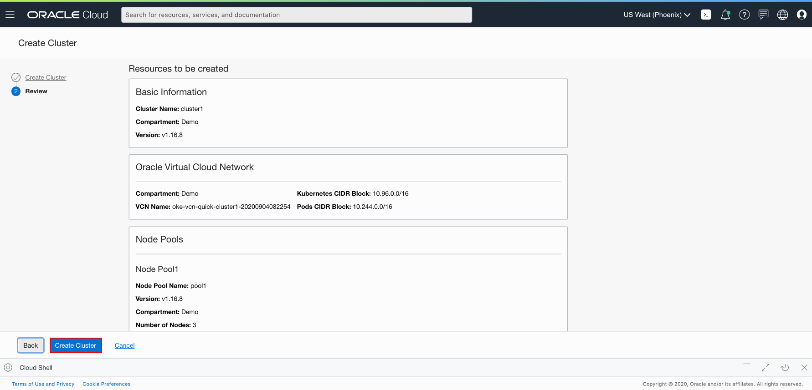
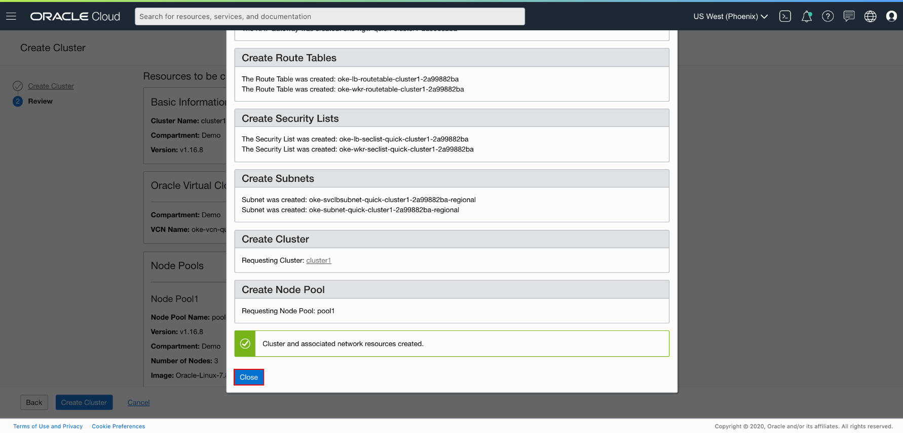
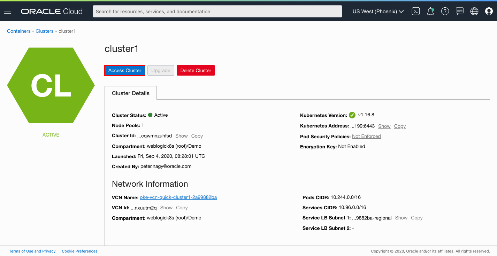
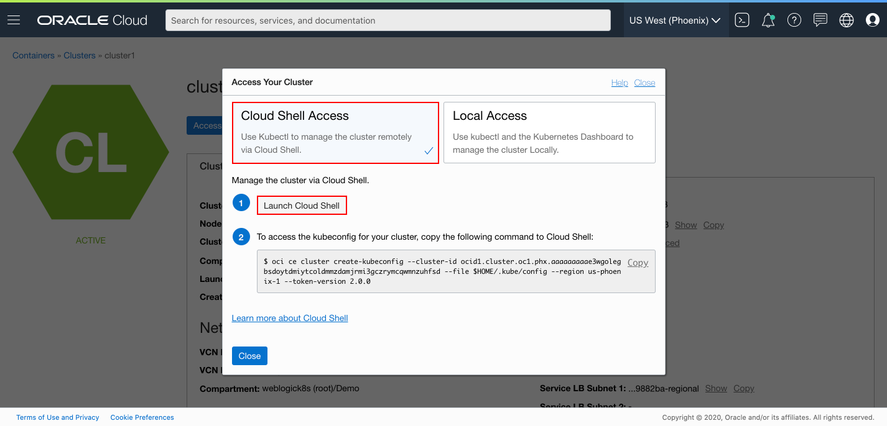
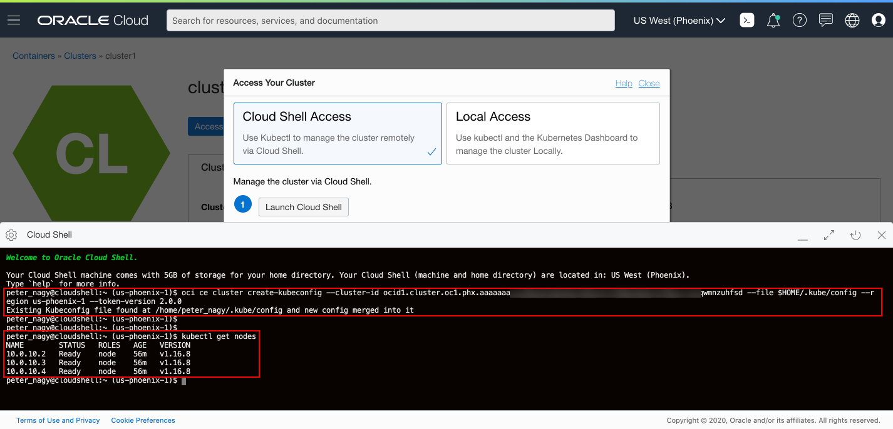
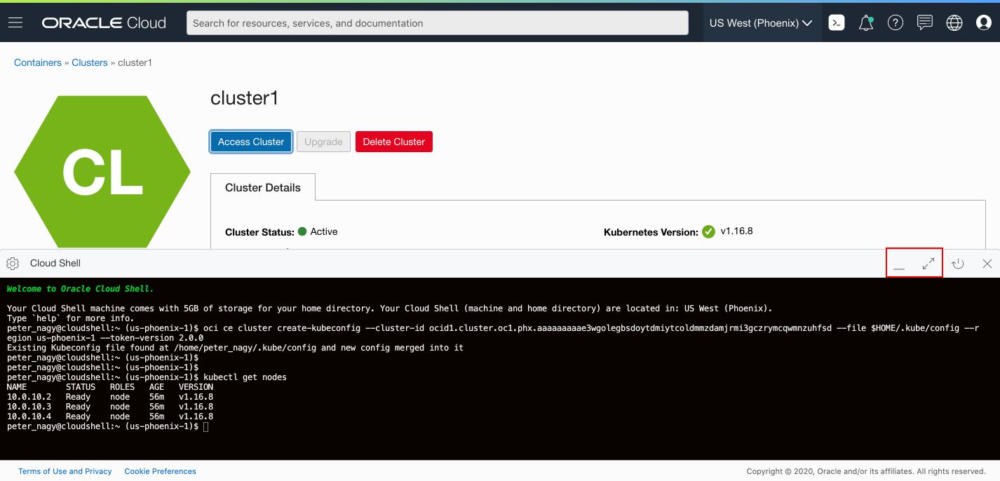

# Create Oracle Container Engine for Kubernetes (OKE) on Oracle Cloud Infrastructure (OCI) #

## Introduction

This lab walks you through the steps how to create managed Kubernetes environment on Oracle Cloud Infrastructure.

### About Product/Technology

Oracle Cloud Infrastructure Container Engine for Kubernetes is a fully-managed, scalable, and highly available service that you can use to deploy your container applications to the cloud. Use the Container Engine for Kubernetes (sometimes abbreviated OKE) when your development team wants to reliably build, deploy, and manage cloud-native applications. You specify the compute resources that your applications require, and OKE provisions them on an Oracle Cloud Infrastructure in an existing OCI tenancy.

### Objectives

In this lab, you will:
* Create OKE (Oracle Kubernetes Engine) instance
* Open the OCI Cloud Shell and configure `kubectl` to interact with the Kubernetes cluster

### Prerequisites ###

You must have an [Oracle Cloud Infrastructure](https://cloud.oracle.com/en_US/cloud-infrastructure) enabled account.

To create the Container Engine for Kubernetes (OKE), complete the following steps:

- Create the network resources (VCN, subnets, security lists, etc.)
- Create a cluster
- Create a `NodePool`

This tutorial shows you the way the *Quick Start* feature creates and configures all the necessary resources for a three node Kubernetes cluster. All the nodes will be deployed in different availability domains to ensure high availability.

For more information about OKE and custom cluster deployment, see the [Oracle Container Engine](https://docs.cloud.oracle.com/iaas/Content/ContEng/Concepts/contengoverview.htm) documentation.

## **STEP 1**: Create an OKE cluster ####

The *Quick Create* feature uses the default settings to create a *quick cluster* with new network resources as required. This approach is the fastest way to create a new cluster. If you accept all the default values, you can create a new cluster in just a few clicks. New network resources for the cluster are created automatically, along with a node pool and three worker nodes.

In the Console, open the navigation menu. Under *Solutions, Platform and Edge*, go to *Developer Services* and select **Container Clusters (OKE)**.



On the Cluster List page, click **Create Cluster**.


In the Create Cluster Solution dialog, select *Quick Create* and click **Launch Workflow**.


**Quick Create** will create a new cluster with default settings, along with new network resources for the new cluster.

Specify the following configuration details on the Cluster Creation page:
- **Name**: The name of the cluster. Leave the default value.
- **Compartment**: The name of the compartment. Leave the default value.
- **Kubernetes version**: The version of Kubernetes. Leave the default value which should be `1.16.8`.
- **Choose Visibility Type**: Is the cluster going to be routable or not. Leave the default *Private* value.
- **Shape**: The shape to use for each node in the node pool. The shape determines the number of CPUs and the amount of memory allocated to each node. The list shows only those shapes available in your tenancy that are supported by OKE. Select the available *VM.Standard2.1*.
- **Number of nodes**: The number of worker nodes to create. Leave the default value, *3*



Click **Next** to review the details you entered for the new cluster.

On the *Review* page, click **Submit** to create the new network resources and the new cluster.



You see the network resources being created for you.



Wait until request to create node pool is initiated and then click **Close**. Then the new cluster is shown on the *Cluster Details* page. When the master nodes are created the new cluster gains a status of *Active* (it takes about 7 minutes). You may continue your labs then.


## **STEP 2**: Configure `kubectl` (Kubernetes Cluster CLI)

Oracle Cloud Infrastructure (OCI) Cloud Shell is a web browser-based terminal, accessible from the Oracle Cloud Console. Cloud Shell provides access to a Linux shell, with a pre-authenticated Oracle Cloud Infrastructure CLI and other useful tools (*Git, kubectl, helm, OCI CLI*) to complete the operator tutorials. Cloud Shell is accessible from the Console. Your Cloud Shell will appear in the Oracle Cloud Console as a persistent frame of the Console, and will stay active as you navigate to different pages of the Console.

You will use Cloud Shell to complete this workshop.

In order for `kubectl` to find and access a Kubernetes cluster, it needs a `kubeconfig` file. This will be generated using the OCI CLI which is pre-authenticated, so there’s no setup to do before you can start using it.

Click **Access Kubeconfig** on your cluster detail page. (If you moved away from that page, then open the navigation menu and under **Developer Services**, select **Clusters**. Select your cluster and go the detail page.)



A dialog appears which offers to open Cloud Shell and contains the customized OCI command that you need to execute, to create a Kubernetes configuration file.

Leave the default *Cloud Shell Access* and first select the **Copy** link to copy the `oci ce...` command to Cloud Shell, then close the configuration dialog before you paste the command into the terminal.


Now click the **Launch Cloud Shell** to open the built in console.



Copy the command from the clipboard (Ctrl+V or right click and copy) into the Cloud Shell and execute.

For example, the command looks like the following:
```bash
$ oci ce cluster create-kubeconfig --cluster-id ocid1.cluster.oc1.phx.aaaaaaaaaezwen..................zjwgm2tqnjvgc2dey3emnsd --file $HOME/.kube/config --region us-phoenix-1 --token-version 2.0.0
Existing Kubeconfig file found at /home/peter_nagy/.kube/config and new config merged into it
```
Now check that `kubectl` is working, for example, using the `get node` command:
```bash
$ kubectl get node
NAME        STATUS   ROLES   AGE    VERSION
10.0.10.2   Ready    node    56m   v1.16.8
10.0.10.3   Ready    node    56m   v1.16.8
10.0.10.4   Ready    node    56m   v1.16.8
```
If you see the node's information, then the configuration was successful.



You can always minimize and restore the terminal size at any time using the buttons on the top right corner of the Cloud Shell.


